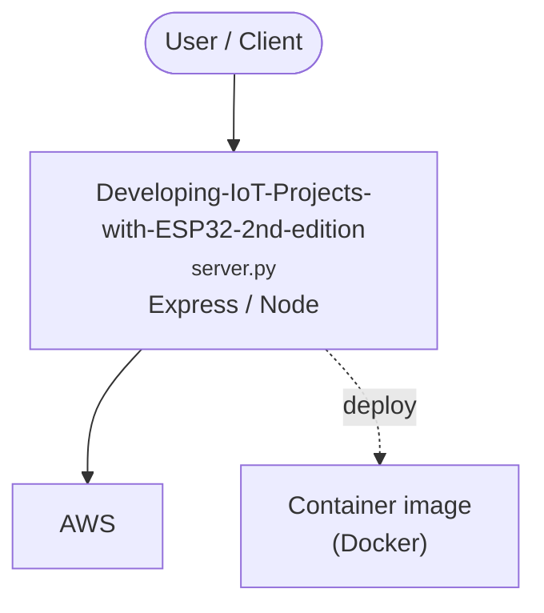

# Context Map — `Developing-IoT-Projects-with-ESP32-2nd-edition`

> Auto-generated architecture & deployment context map. Summarizes the core application, container/cloud footprint, and database connections. Regenerate after significant structural changes.

**Repo:** `avnit/Developing-IoT-Projects-with-ESP32-2nd-edition` · **Fork** · Public · Primary language: C · Default branch: `main` · Files: 8497

**Description:** Developing IoT Projects with ESP32, 2nd edition - Published by Packt

## 1. Core application

Developing-IoT-Projects-with-ESP32, Second-edition

- **Frameworks / runtime:** Express / Node
- **Entry points:** `ch4/flatbuffers_ex/components/flatbuffers/grpc/examples/python/greeter/server.py`, `ch4/flatbuffers_ex/components/flatbuffers/grpc/examples/ts/greeter/src/server.ts`, `ch4/flatbuffers_ex/components/flatbuffers/tests/FlatBuffers.Benchmarks/Program.cs`, `ch4/flatbuffers_ex/components/flatbuffers/tests/FlatBuffers.Test/Program.cs`, `ch4/flatbuffers_ex/components/flatbuffers/ts/index.ts`, `components/lvgl/lvgl/tests/main.py`
- **Listens on port(s):** 1045, 1046, 1053, 1080, 1081, 1083

## 2. Containers & cloud applications

**Containers:**
- `ch4/flatbuffers_ex/components/flatbuffers/tests/docker/Dockerfile.testing.build_flatc_debian_stretch`
- `ch4/flatbuffers_ex/components/flatbuffers/tests/docker/Dockerfile.testing.cpp.debian_buster`
- `ch4/flatbuffers_ex/components/flatbuffers/tests/docker/languages/Dockerfile.testing.csharp.mono_5_18`
- `ch4/flatbuffers_ex/components/flatbuffers/tests/docker/languages/Dockerfile.testing.golang.1_11`
- `ch4/flatbuffers_ex/components/flatbuffers/tests/docker/languages/Dockerfile.testing.java.openjdk_10_0_2`
- `ch4/flatbuffers_ex/components/flatbuffers/tests/docker/languages/Dockerfile.testing.java.openjdk_11_0_1`
- `ch4/flatbuffers_ex/components/flatbuffers/tests/docker/languages/Dockerfile.testing.node.12_20_1`
- `ch4/flatbuffers_ex/components/flatbuffers/tests/docker/languages/Dockerfile.testing.node.14_15_4`
- `ch4/flatbuffers_ex/components/flatbuffers/tests/docker/languages/Dockerfile.testing.php.zend_7_3`
- `ch4/flatbuffers_ex/components/flatbuffers/tests/docker/languages/Dockerfile.testing.python.cpython_2_7_15`
- `ch4/flatbuffers_ex/components/flatbuffers/tests/docker/languages/Dockerfile.testing.python.cpython_3_7_1`
- `ch4/flatbuffers_ex/components/flatbuffers/tests/docker/languages/Dockerfile.testing.python.numpy.cpython_2_7_15`

**Detected cloud platforms / services:** AWS, Terraform

## 3. Database connections

_No database drivers or connection strings detected._

## 4. Architecture diagram

## 5. Security posture

- **Static scan findings:** 1 critical, 5 high, 2 medium

| Severity | Rule | File:Line |
|---|---|---|
| critical | private-key-block | `ch7/ota_http_ex/server/key.pem:1` |
| high | py-shell-true | `ch4/flatbuffers_ex/components/flatbuffers/conan/build.py:12` |
| high | py-eval-exec | `ch4/littlefs_ex/components/joltwallet__littlefs/src/littlefs/scripts/test.py:231` |
| high | py-eval-exec | `ch4/littlefs_ex/components/joltwallet__littlefs/src/littlefs/scripts/test.py:461` |
| high | py-eval-exec | `components/lvgl/lvgl/docs/example_list.py:86` |
| high | py-shell-true | `components/lvgl/lvgl/scripts/release/patch.py:30` |
| medium | hardcoded-ssh-known-hosts-off | `ch10/components/esp-skainet/components/esp-sr/ci/utils.sh:17` |
| medium | js-innerhtml | `components/lvgl/lvgl/docs/_templates/page.html:29` |

---
_Generated by repo context-mapping pass on 2026-08-13._